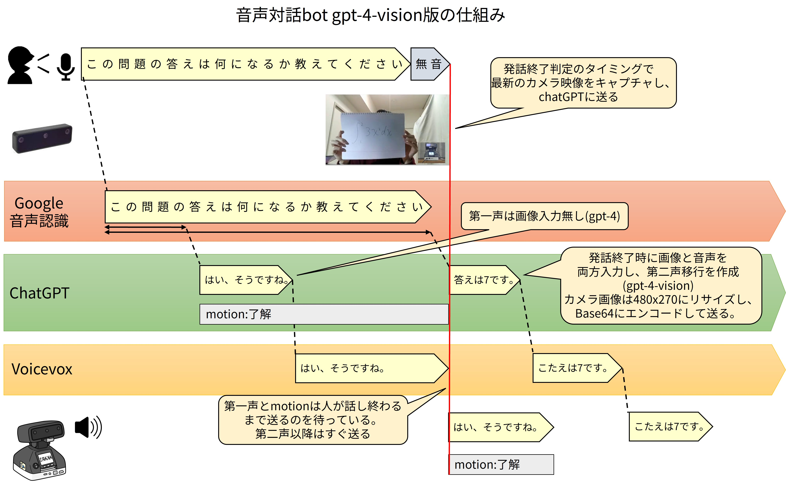
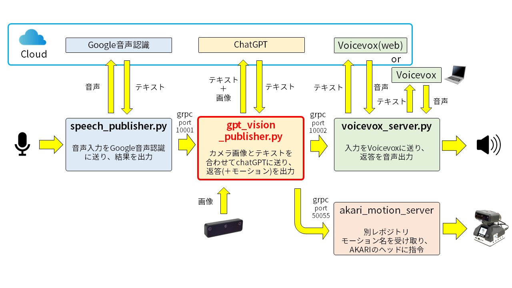
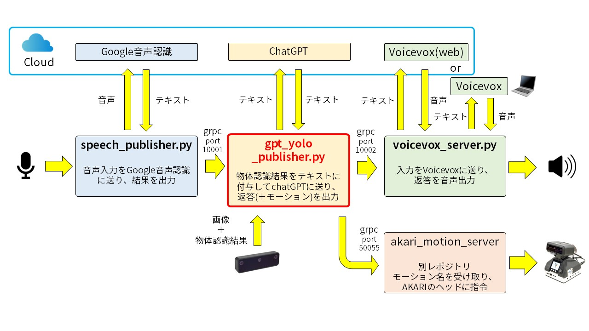
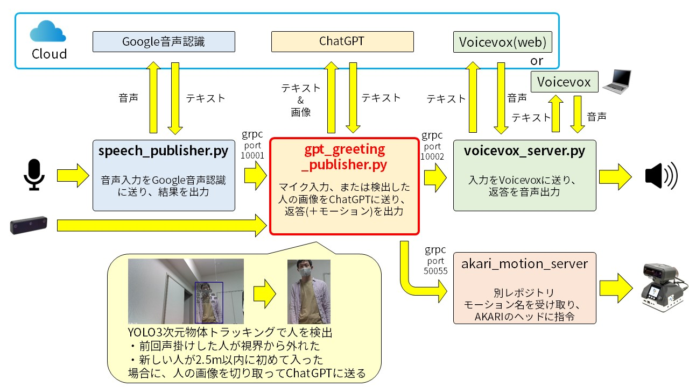

# akari_chatgpt_vision_bot

AKARIの音声対話botに画像認識機能を追加するアプリ

## submoduleの更新
`git submodule update --init --recursive`  

## 仮想環境の作成
`python -m venv venv`  
`source venv/bin/activate`  
`pip install -r requirements.txt`  

## セットアップ方法
[akari_chatgpt_botのREADME](https://github.com/AkariGroup/akari_chatgpt_bot/blob/main/README.md)のセットアップ手順に沿って実行する。

## 音声対話bot(VLM版)

### 概要

[akari_chatgpt_bot](https://github.com/AkariGroup/akari_chatgpt_bot)の遅延なし音声対話botに、GPT-4V,Claude3による画像認識機能を追加したものです。  

### 全体図

### 起動方法

1. [akari_chatgpt_botのREADME](https://github.com/AkariGroup/akari_chatgpt_bot/blob/main/README.md)内 **遅延なし音声対話botの実行** の起動方法1.~3.を実行する。  

2. gpt_vision_publisherを起動する。(ChatGPTへ画像と文章のリクエストを送信し、受信結果をvoicevox_serverへ渡す。)  
   `python3 gpt_vision_publisher.py`  

   引数は下記が使用可能  
   - `-v`, `--vision_model`: 画像と音声を入力するLLMのモデル。デフォルトは"gpt-4-vision-preview"  
   - `--ip`: gpt_serverのIPアドレス。デフォルトは"127.0.0.1"  
   - `--port`: gpt_serverのポート。デフォルトは"10001"  
   - `--selective`: このオプションをつけると、画像を用いて回答するかどうかをLLMが判別してから回答を返すようになる。"  
   - `-j`, `--judge_model`: 画像を使用するか判断するLLMのモデル。`--selective`オプションが有効の時のみ使用される。デフォルトは"claude-3-haiku-20240307"。  

3. speech_publisher.pyを起動する。(Google音声認識の結果をgpt_publisherへ渡す。)  
   **--no_motionオプションをつけること(つけないと音声認識中にうなずきが再生されてしまい、画像が正しく取得できません。)**
   `python3 speech_publisher.py --no_motion`  

   引数は下記が使用可能  
   - `--robot_ip`: akari_motion_serverのIPアドレス。デフォルトは"127.0.0.1"
   - `--robot_port`: akari_motion_serverのポート。デフォルトは"50055"
   - `--gpt_ip`: gpt_serverのIPアドレス。デフォルトは"127.0.0.1"
   - `--gpt_port`: gpt_serverのポート。デフォルトは"10001"
   - `--voicevox_ip`: voicevox_serverのIPアドレス。デフォルトは"127.0.0.1"
   - `--voicevox_port`: voicevox_serverのポート。デフォルトは"10002"
   - `-t`,`--timeout`: マイク入力がこの時間しきい値以下になったら音声入力を打ち切る。デフォルトは0.5[s]。短いと応答が早くなるが不安定になりやすい。  
   - `-p`,`--power_threshold`: マイク入力の音量しきい値。デフォルトは0で、0の場合アプリ起動時に周辺環境の音量を取得し、そこから音量しきい値を自動決定する。  
   - `--no_motion`: このオプションをつけた場合、音声入力中のうなずき動作を無効化する。  

4. カメラの画像表示をするウィンドウが起動したら、`speech_publisher.py`のターミナルでEnterキーを押し、マイクに話しかけるとカメラ画像の表示されているウィンドウに基づいた返答が返ってくる。  

### スクリプトで一括起動する方法

1. [akari_chatgpt_botのREADME](https://github.com/AkariGroup/akari_chatgpt_bot/blob/main/README.md)内 **VOICEVOXをOSS版で使いたい場合** の手順を元に、別PCでVoicevoxを起動しておく。  

2. スクリプトを実行する。  

   `cd script`  
   (毎回画像を用いて回答させる場合)
   `./vision_chatbot.sh {1.でVoicevoxを起動したPCのIPアドレス} {akari_motion_serverのパス}`  
   (画像を使うかどうかを都度LLMに判断させて回答させる場合)
   `./selective_vision_chatbot.sh {1.でVoicevoxを起動したPCのIPアドレス} {akari_motion_serverのパス}`  

   akari_motion_serverのパスを入力しなければ、akari_motion_serverは起動せず、モーションの再生は行われません(OAK-Dがあれば、AKARI以外でも使えます)。  

3. カメラの画像表示をするウィンドウが起動したら、`speech_publisher.py`のターミナルでEnterキーを押し、マイクに話しかけるとカメラ画像の表示されているウィンドウに基づいた返答が返ってくる。  

## 音声対話bot(YOLO版)

### 概要

[akari_chatgpt_bot](https://github.com/AkariGroup/akari_chatgpt_bot)の遅延なし音声対話botに、YOLOの3次元位置物体認識の認識結果を組み合わせてChatGPTに送信する機能を追加したものです。  

### 全体図

### 起動方法

1. [akari_chatgpt_botのREADME](https://github.com/AkariGroup/akari_chatgpt_bot/blob/main/README.md)内 **遅延なし音声対話botの実行** の起動方法1.~3.を実行する。  

2. gpt_yolo_publisherを起動する。(ChatGPTへ画像と文章のリクエストを送信し、受信結果をvoicevox_serverへ渡す。)  
   `python3 gpt_yolo_publisher.py`  

   引数は下記が使用可能  
   - `-m`, `--model`: オリジナルのYOLO認識モデル(.blob)を用いる場合にパスを指定。引数を指定しない場合、YOLO v4のCOCOデータセット学習モデルを用いる。  
   - `-c`, `--config`: オリジナルのYOLO認識ラベル(.json)を用いる場合にパスを指定。引数を指定しない場合、YOLO v4のCOCOデータセット学習ラベルを用いる。  
   - `-f`, `--fps`: カメラ画像の取得PFS。デフォルトは8。OAK-Dの性質上、推論の処理速度を上回る入力を与えるとアプリが異常終了しやすくなるため注意。  
   - `--ip`: gpt_serverのIPアドレス。デフォルトは"127.0.0.1"  
   - `--port`: gpt_serverのポート。デフォルトは"10001"  

3. speech_publisher.pyを起動する。(Google音声認識の結果をgpt_publisherへ渡す。)  
   **--no_motionオプションをつけること(つけないと音声認識中にうなずきが再生されてしまい、画像が正しく取得できません。)**
   `python3 speech_publisher.py --no_motion`  

   引数は下記が使用可能  
   - `--robot_ip`: akari_motion_serverのIPアドレス。デフォルトは"127.0.0.1"
   - `--robot_port`: akari_motion_serverのポート。デフォルトは"50055"
   - `--gpt_ip`: gpt_serverのIPアドレス。デフォルトは"127.0.0.1"
   - `--gpt_port`: gpt_serverのポート。デフォルトは"10001"
   - `--voicevox_ip`: voicevox_serverのIPアドレス。デフォルトは"127.0.0.1"
   - `--voicevox_port`: voicevox_serverのポート。デフォルトは"10002"
   - `-t`,`--timeout`: マイク入力がこの時間しきい値以下になったら音声入力を打ち切る。デフォルトは0.5[s]。短いと応答が早くなるが不安定になりやすい。  
   - `-p`,`--power_threshold`: マイク入力の音量しきい値。デフォルトは0で、0の場合アプリ起動時に周辺環境の音量を取得し、そこから音量しきい値を自動決定する。  
   - `--no_motion`: このオプションをつけた場合、音声入力中のうなずき動作を無効化する。  

4. カメラの画像表示をするウィンドウが起動したら、`speech_publisher.py`のターミナルでEnterキーを押し、マイクに話しかけるとカメラ画像のウィンドウに表示されている物体認識結果に基づいた返答が返ってくる。  

### スクリプトで一括起動する方法

1. [akari_chatgpt_botのREADME](https://github.com/AkariGroup/akari_chatgpt_bot/blob/main/README.md)内 **VOICEVOXをOSS版で使いたい場合** の手順を元に、別PCでVoicevoxを起動しておく。  

2. スクリプトを実行する。  

   `cd script`  
   `./yolo_chatbot.sh {1.でVoicevoxを起動したPCのIPアドレス} {akari_motion_serverのパス}`  

   akari_motion_serverのパスを入力しなければ、akari_motion_serverは起動せず、モーションの再生は行われません(OAK-Dがあれば、AKARI以外でも使えます)。  

3. カメラの画像表示をするウィンドウが起動したら、`speech_publisher.py`のターミナルでEnterキーを押し、マイクに話しかけるとカメラ画像のウィンドウに表示されている物体認識結果に基づいた返答が返ってくる。  

## 音声対話bot(声掛け版)

### 概要

[akari_chatgpt_bot](https://github.com/AkariGroup/akari_chatgpt_bot)の遅延なし音声対話botに、AKARI側から自発的に声掛けしてくる機能を追加したものです。  
YOLOの3次元物体トラッキングを用いて、人を検知したらGPT-4V,Claude3に人の画像を送り、その人にあった声掛けを行うアプリです。AKARIの視界に初めて入った、かつ一定距離以内に近づいた人にのみ声掛けします。  

### 全体図

### 起動方法

1. [akari_chatgpt_botのREADME](https://github.com/AkariGroup/akari_chatgpt_bot/blob/main/README.md)内 **遅延なし音声対話botの実行** の起動方法1.~3.を実行する。  

2. gpt_greeting_publisherを起動する。(ChatGPTへ画像と文章のリクエストを送信し、受信結果をvoicevox_serverへ渡す。)  
   `python3 gpt_greeting_publisher.py`  

   引数は下記が使用可能  
   - `-m`, `--model`: オリジナルのYOLO認識モデル(.blob)を用いる場合にパスを指定。引数を指定しない場合、YOLO v4のCOCOデータセット学習モデルを用いる。  
   - `-c`, `--config`: オリジナルのYOLO認識ラベル(.json)を用いる場合にパスを指定。引数を指定しない場合、YOLO v4のCOCOデータセット学習ラベルを用いる。  
   - `-f`, `--fps`: カメラ画像の取得PFS。デフォルトは8。OAK-Dの性質上、推論の処理速度を上回る入力を与えるとアプリが異常終了しやすくなるため注意。  
   - `-r`, `--robot_coordinate`: 人との距離を検出する際に、カメラから見た距離ではなく、AKARIのヘッドの角度に応じて座標変換してAKARI正面からの角度に変換するかどうか。  
   - `--ip`: gpt_serverのIPアドレス。デフォルトは"127.0.0.1"  
   - `--port`: gpt_serverのポート。デフォルトは"10001"  

3. speech_publisher.pyを起動する。(Google音声認識の結果をgpt_publisherへ渡す。)  
   **--no_motionオプションをつけること(つけないと音声認識中にうなずきが再生されてしまい、画像が正しく取得できません。)**
   `python3 speech_publisher.py --no_motion`  

   引数は下記が使用可能  
   - `--robot_ip`: akari_motion_serverのIPアドレス。デフォルトは"127.0.0.1"  
   - `--robot_port`: akari_motion_serverのポート。デフォルトは"50055"  
   - `--gpt_ip`: gpt_serverのIPアドレス。デフォルトは"127.0.0.1"  
   - `--gpt_port`: gpt_serverのポート。デフォルトは"10001"  
   - `--voicevox_ip`: voicevox_serverのIPアドレス。デフォルトは"127.0.0.1"  
   - `--voicevox_port`: voicevox_serverのポート。デフォルトは"10002"  
   - `-t`,`--timeout`: マイク入力がこの時間しきい値以下になったら音声入力を打ち切る。デフォルトは0.5[s]。短いと応答が早くなるが不安定になりやすい。  
   - `-p`,`--power_threshold`: マイク入力の音量しきい値。デフォルトは0で、0の場合アプリ起動時に周辺環境の音量を取得し、そこから音量しきい値を自動決定する。  
   - `--no_motion`: このオプションをつけた場合、音声入力中のうなずき動作を無効化する。  

4. カメラの画像表示をするウィンドウが起動後、AKARIの近くに近づくと外見、服装に応じてAKARIが声掛けをしてくる。  
   `speech_publisher.py`のターミナルでEnterキーを押し、マイクに話しかけると返答が返ってくる。  

### スクリプトで一括起動する方法

1. [akari_chatgpt_botのREADME](https://github.com/AkariGroup/akari_chatgpt_bot/blob/main/README.md)内 **VOICEVOXをOSS版で使いたい場合** の手順を元に、別PCでVoicevoxを起動しておく。  

2. スクリプトを実行する。  

   `cd script`  
   `./greeting_chatbot.sh {1.でVoicevoxを起動したPCのIPアドレス} {akari_motion_serverのパス}`  

   akari_motion_serverのパスを入力しなければ、akari_motion_serverは起動せず、モーションの再生は行われません(OAK-Dがあれば、AKARI以外でも使えます)。  

4. カメラの画像表示をするウィンドウが起動後、AKARIの近くに近づくと外見、服装に応じてAKARIが声掛けをしてくる。  
   `speech_publisher.py`のターミナルでEnterキーを押し、マイクに話しかけると返答が返ってくる。  
